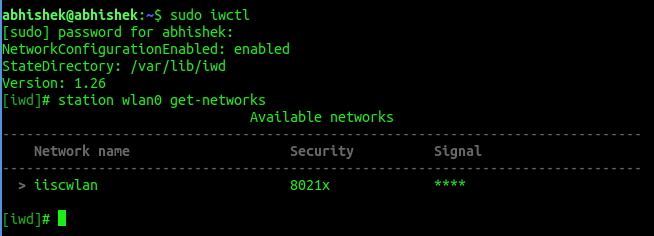

# Details on setting up the AX200 on my Linux Machine (Running Lubuntu 22.04 with 6.5.0-28 kernel)

So, basically the situation is as follows, the AX200 card is a good one, but it does not perform well with the NetworkManager with `wpa_supplicant` backend. There are frequent disconnects - to an extent that it is gets unusable. Moreover, switching the backend (of NetworkManager) to make use of `iwd` didn't work out for me either.

So, I decided to switch to `iwd` in totality. `iwd` has a nice CLI tool, and it can work standalone and does not require network manager in the path.

First install `iwd`

```
$ sudo apt install iwd
```

> Configuring NetworkManager to make use of `iwd` backend did not work for me. Basically the STEP BELOW DID NOT WORK FOR ME:
> 
> ```
> sudo nano /etc/NetworkManager/NetworkManager.conf
> ```
> And add or modify the `[device]` section:
> ```
> [device]
> wifi.backend=iwd
> ```
> Restart both IWD and NetworkManager for the changes to take effect:
> ```
> sudo systemctl restart iwd
> sudo systemctl restart NetworkManager
> ```

First we have to stop and disable NetworkManager or else it shall start using `iwd` or `wpa_supplicant` and get hold of the devices making it unavailable for the `iwd` cli to use it.

```
sudo systemctl stop NetworkManager
sudo systemctl disable NetworkManager
```

The NetworkManager service will be stopped immediately and disabled from starting automatically during the next boot cycle. Disabling a service using systemctl disable removes its symbolic links from the startup directories, so it will not start on boot.

The devices managed by the network manager can be listed by 
```
$ nmcli device
```

which shall give you an idea of what are devices active or hogged by the network manager. If the network manager is disabled, it shall show that it cannot proceed, because the network manager is disabled.

Start and enable iwd.
```
sudo systemctl start iwd
sudo systemctl enable iwd
```
Use `ifconfig` or `iwconfig` to get the name of the wifi adaptor. It happens to be `wlan0` in my case.

###  Enable Network Configuration in IWD
For iwd to be able to handle the connection through passwords and all, we need to change the configuration at `/etc/iwd/main.conf`

IWD needs to manage network configuration for Enterprise connections.

1. Open or create the IWD configuration file:
    ```
    sudo nano /etc/iwd/main.conf
    ```
2. Add the following section to enable network configuration:
    ```
    [General]
    EnableNetworkConfiguration=true
    ```
3. Restart the IWD service:
    ```
    sudo systemctl restart iwd
    ```

### Getting hold of the network SSID and creating a credential file

1. Launch the `iwctl` interative shell:
    ```
    sudo iwctl
    ```
2. Find the available networks:
    ```
    station wlan0 scan
    station wlan0 get-networks
    ```
    
    As we can see, it shows the network which is available.

3. Next we shall create a predefined configuration file for this SSID:
    - Navigate to the IWD network configuration directory and create a file named `<SSID>.8021x` (replace `<SSID>` with your network name). `iiscwlan.8021x` in my case:
        ```
        $ sudo cat /var/lib/iwd/iiscwlan.8021x

        [Security]
        EAP-Method=PEAP
        EAP-Identity=abhishekghos@iisc.ac.in
        EAP-PEAP-Phase2-Method=MSCHAPV2
        EAP-PEAP-Phase2-Identity=abhishekghos@iisc.ac.in
        EAP-PEAP-Phase2-Password=<THE PASSWORD>

        [Settings]
        AutoConnect=true
        ```

        Note that when you connect using NetworkManager with iwd backend the configuration shall be automatically updated as:
        ```
        sudo cat /var/lib/iwd/iiscwlan.8021x
        # Auto-generated from NetworkManager connection "iiscwlan"
        # Changes to that connection overwrite this file when enabled by NM's [main].iwd-config-path value

        [IPv6]
        Enabled=true

        [Security]
        EAP-Method=PEAP
        EAP-Identity=abhishekghos@iisc.ac.in
        EAP-PEAP-Phase2-Method=MSCHAPV2
        EAP-PEAP-Phase2-Identity=abhishekghos@iisc.ac.in
        EAP-PEAP-Phase2-Password=<THE PASSWORD>
        ```
    - Save and exit the file. Restart IWD to apply changes:
        ```
        sudo systemctl restart iwd
        ```
### Connecting to the network
- Again open the `iwctl` shell
- now type :
    ```
    station wlan connect iiscwlan
    ```
- The shell prompt shall just return, indicating success full connection.

### Changing the preference for 5GHz network
- By default, iwd shall try to connect to best possible signal frequency.
- In my case, the 5GHz signal strength was weak, and it connected to the `2.4GHz` network by default.
- The link [here](https://man.archlinux.org/man/iwd.config.5.en#Rank), shows how to change the preference:
  ```
  sudo nano /etc/iwd/main.conf
  ```
  and add the following lines:
  ```
    [Rank]
    BandModifier5GHz=1.0
    BandModifier2_4GHz=0.5 
    ```
### The AX200 has some issue with power management, so it gives best performance when power management option is turned off.

#### Create a Systemd Service
1. Create a custom systemd service to disable power management:
    ```
    sudo nano /etc/systemd/system/disable-wifi-power-save.service
    ```
2.  Add the following content:
    ```
    [Unit]
    Description=Disable Wi-Fi Power Management
    After=network.target iwd.service
    Requires=iwd.service

    [Service]
    Type=oneshot
    ExecStart=/sbin/iw wlan0 set power_save off

    [Install]
    WantedBy=multi-user.target

    ```
    Note:
    - After=network.target: Ensures the service starts after the basic network stack is initialized.
    - After=iwd.service: Ensures the service starts after the IWD daemon is ready.
    - Use them based on whether your service relies on the generic network stack (network.target) or specifically on IWD (iwd.service).
3. Reload systemd to recognize the new service:
    ```
    sudo systemctl daemon-reload
    ```
4. Enable and start the service:
    ```
    sudo systemctl enable disable-wifi-power-save.service
    sudo systemctl start disable-wifi-power-save.service
    ```
5. Verify that power management is disabled:

    ```
    $ iwconfig wlan0
    wlan0     IEEE 802.11  ESSID:"iiscwlan"  
            Mode:Managed  Frequency:5.2 GHz  Access Point: 88:B1:E1:AB:F7:A0   
            Bit Rate=156 Mb/s   Tx-Power=22 dBm   
            Retry short limit:7   RTS thr:off   Fragment thr:off
            Power Management:off
            Link Quality=57/70  Signal level=-53 dBm  
            Rx invalid nwid:0  Rx invalid crypt:0  Rx invalid frag:0
            Tx excessive retries:0  Invalid misc:2135   Missed beacon:0
    ```
